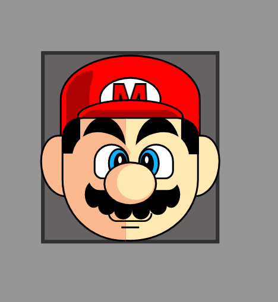

  <h1><b>My arts with CSS</b> 🛠️🧪</h1>
  <h6>by <i>FranciscoCharles</i></h6>

Este repositorio é destinado a qualquer arte que eu venha a fazer em CSS.
A fim de demonstar minhas habilidades com essa tecnoligia que possui tantos truques e funcionalidades.

# <a name=index>Indice📚</a>

Atualmente as artes são:

- [**Mario**](#mario)
- [**Licença do projeto**](#license)

# **<a name=mario> Mario </a>** <h6>[voltar ao indice](#index)</h6>
Apenas o rosto do mario totalmente feito em CSS. Para visualizar os códigos para esse desenho clique nesse [link](./src/mario).

    
     
    <h6>
        Figure 1 - mario.
    </h6>

# **<a name=license>Licença</a>**  <h6>[voltar ao indice](#index)</h6>

Para mais informações sobre a licença deste projeto, leia o arquivo <a href="./LICENSE" title="go to license file">LICENSE</a>.

---

    Copyright © 2021 <b>FranciscoCharles</b>

